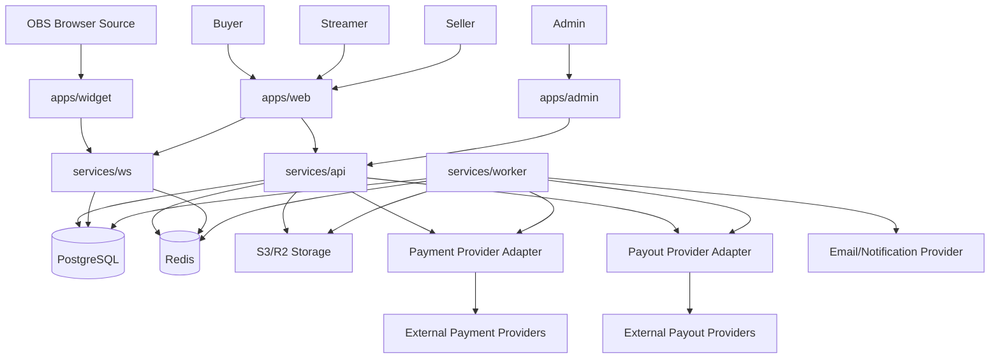
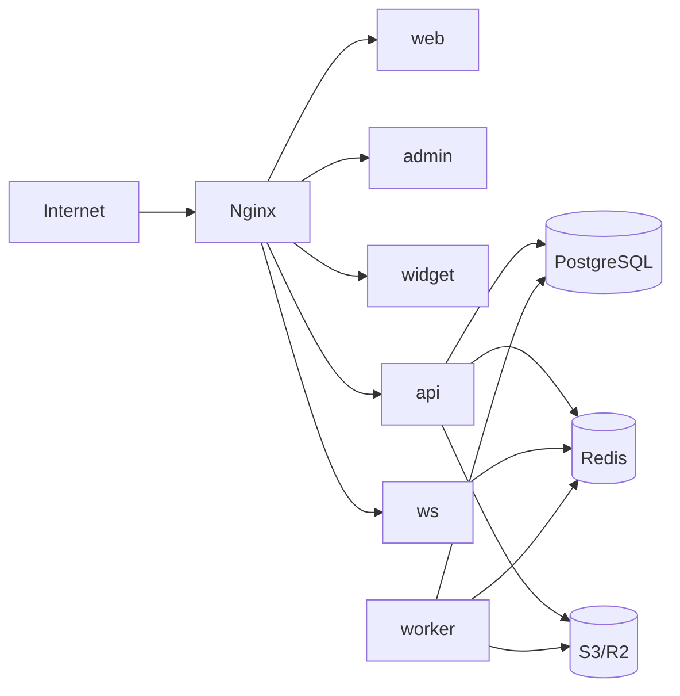
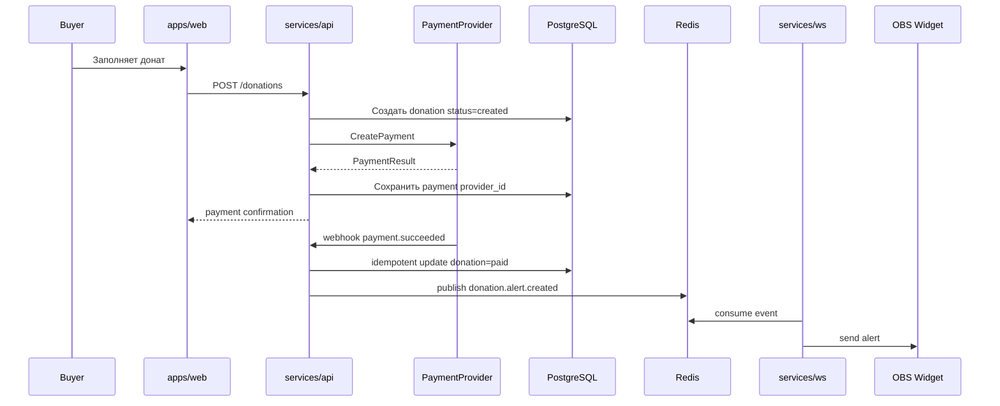
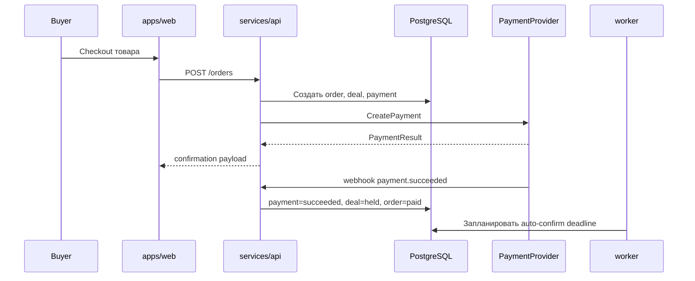
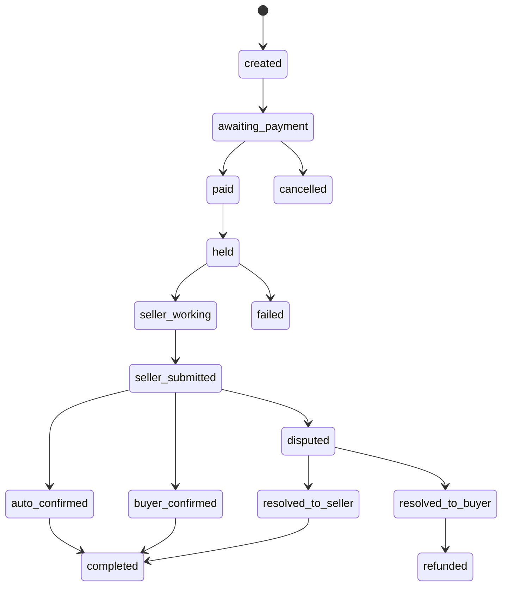
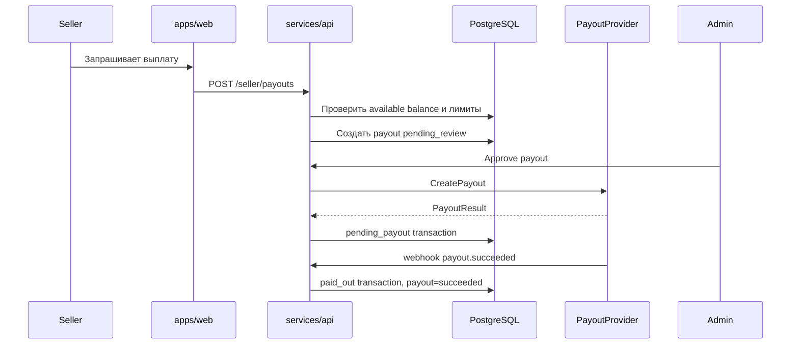
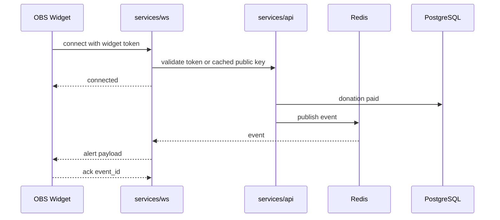

# ARCHITECTURE.md

## Общее описание

FanFuel проектируется как monorepo с независимыми приложениями и сервисами:

- `apps/web` — основной пользовательский сайт на Next.js.
- `apps/widget` — лёгкие OBS/browser source виджеты на Vite + React.
- `apps/admin` — админка платформы.
- `apps/mobile-web` — будущий mobile-first/PWA интерфейс, если будет выделен отдельно.
- `services/api` — Go REST API.
- `services/ws` — Go WebSocket gateway.
- `services/worker` — фоновые задачи: webhooks, очереди, выплаты, письма, scheduled jobs.
- `packages/ui` — общий UI kit.
- `packages/sdk` — клиентский SDK для виджетов и интеграций.
- `packages/i18n` — словари и helpers локализации.
- `infra` — Docker, nginx, migrations, scripts.

Архитектура должна быть модульной, но не преждевременно микросервисной. На раннем этапе достаточно отдельных Go-сервисов для API, WebSocket и workers, общей PostgreSQL БД и Redis.

## Диаграмма модулей



## Frontend architecture

### apps/web

Основной сайт:

- публичные страницы;
- marketplace;
- creator pages;
- donate pages;
- checkout;
- buyer dashboard;
- streamer studio;
- seller dashboard.

Требования:

- TypeScript strict mode;
- i18n для всех пользовательских текстов;
- responsive layout;
- PWA-ready;
- API client через typed SDK;
- no direct payment provider calls from frontend, кроме provider redirect/confirmation flow, если это требуется адаптером.

### apps/admin

Админка может быть Next.js или Vite. Решение фиксируется отдельным ADR, если будет отличаться от `apps/web`.

Требования:

- строгая role/permission проверка;
- audit-friendly actions;
- таблицы с фильтрами;
- queues для moderation, disputes, payouts, risk flags;
- подтверждение опасных действий;
- отсутствие реальных секретов в UI.

### apps/widget

OBS/browser source виджеты:

- Vite + React + TypeScript;
- минимальные зависимости;
- подключение по URL с signed widget token;
- read-only режим;
- получение событий по WebSocket;
- reconnect strategy;
- heartbeat;
- локальная кастомизация только через безопасный config от API;
- никакого изменения настроек через публичный widget URL.

## Backend architecture

### services/api

Go REST API отвечает за:

- auth;
- profiles;
- marketplace;
- donations;
- orders;
- safe deals;
- payments;
- payouts;
- disputes;
- reviews;
- admin operations;
- signed upload/download URLs;
- audit logs.

Текущее состояние auth (`v0.3.5`):

- auth реализован через JWT access token, bcrypt и `Authorization: Bearer`;
- `/api/v1/auth/identify` выбирает парольный вход для существующего email или подтверждение нового email;
- новый аккаунт создаётся только по короткоживущему registration token после одноразового email-кода; verification challenge хранит HMAC digest, срок и лимиты попыток;
- отправка кода идёт через `EmailSender` и SMTP-конфигурацию из environment; синхронная отправка в API является временным MVP-решением, перенос retries в worker запланирован при росте нагрузки;
- роли `buyer`, `streamer`, `seller`, `admin` проверяются на backend;
- public registration не выдаёт `admin`;
- dev bootstrap admin работает только вне production через `ADMIN_BOOTSTRAP_EMAIL`;
- реализованы базовые endpoints `/api/v1/auth/*`, `/api/v1/profiles/{slug}`, `/api/v1/creators/{slug}`, `/api/v1/admin/users*`.

Слои:

```txt
handlers -> services/usecases -> repositories -> database
                         -> providers
                         -> event publisher
```

Правила:

- domain statuses не зависят от provider statuses;
- деньги хранятся в integer minor units;
- все финансовые операции идут через ledger-like `balance_transactions`;
- все внешние callbacks проходят через webhook handler;
- опасные операции требуют idempotency key;
- admin actions пишутся в audit log.

### services/worker

Фоновые задачи:

- обработка provider webhooks;
- retries платежных операций;
- auto-confirm safe deals;
- scheduled payout checks;
- отправка email/notification;
- malware/virus review placeholder;
- cleanup временных файлов;
- recalculation analytics snapshots;
- ingestion событий от bot/integration слоя YouTube, Twitch и Telegram;
- пересчёт `CreatorMetricSnapshot` для Studio statistics.

Очереди можно начать с Redis, но интерфейс должен позволять миграцию на отдельную очередь позже.

## WebSocket architecture

`services/ws` отвечает за realtime-события:

- OBS alerts;
- donation goal updates;
- Studio activity feed updates;
- creator metric snapshot updates;
- marketplace purchase events;
- order status updates;
- dispute updates;
- admin status changes.

Каналы:

- `creator:{creator_id}:alerts`;
- `creator:{creator_id}:goals`;
- `user:{user_id}:notifications`;
- `order:{order_id}`;
- `dispute:{dispute_id}`;
- `admin:review_queue`.

Требования:

- signed widget token;
- read-only token для OBS widgets;
- token expiration и rotation;
- rate limiting;
- heartbeat/ping-pong;
- reconnect with backoff;
- event schema versioning;
- idempotent client handling через `event_id`;
- Redis pub/sub или streams на старте.

Пример event envelope:

```json
{
  "event_id": "evt_01H...",
  "event_type": "donation.alert.created",
  "event_version": 1,
  "occurred_at": "2026-05-08T10:00:00Z",
  "channel": "creator:uuid:alerts",
  "payload": {}
}
```

## Payment abstraction

Платёжная логика строится вокруг интерфейсов:

```go
type PaymentProvider interface {
    CreatePayment(ctx context.Context, req CreatePaymentRequest) (*PaymentResult, error)
    GetPayment(ctx context.Context, providerPaymentID string) (*PaymentStatus, error)
    RefundPayment(ctx context.Context, req RefundRequest) (*RefundResult, error)
}

type SafeDealProvider interface {
    CreateDeal(ctx context.Context, req CreateDealRequest) (*DealResult, error)
    CaptureDeal(ctx context.Context, req CaptureDealRequest) (*DealResult, error)
    CancelDeal(ctx context.Context, req CancelDealRequest) (*DealResult, error)
}

type PayoutProvider interface {
    CreatePayout(ctx context.Context, req CreatePayoutRequest) (*PayoutResult, error)
    GetPayout(ctx context.Context, providerPayoutID string) (*PayoutStatus, error)
}

type FiscalizationProvider interface {
    CreateReceipt(ctx context.Context, req CreateReceiptRequest) (*ReceiptResult, error)
    RefundReceipt(ctx context.Context, req RefundReceiptRequest) (*ReceiptResult, error)
}

type ProviderWebhookHandler interface {
    VerifySignature(ctx context.Context, headers map[string]string, body []byte) error
    ParseEvent(ctx context.Context, body []byte) (*ProviderWebhookEvent, error)
}
```

Provider-specific statuses маппятся в internal statuses:

- `payment_status`: `created`, `pending`, `succeeded`, `failed`, `cancelled`, `refunded`, `partially_refunded`.
- `payout_status`: `created`, `pending_review`, `processing`, `succeeded`, `failed`, `cancelled`.
- `deal_status`: см. `docs/DOMAIN_MODEL.md`.

## Storage architecture

S3/R2-compatible storage используется для:

- аватаров;
- баннеров;
- медиа товаров;
- цифровых файлов товаров;
- evidence files для споров;
- alert sounds;
- overlay assets.

Стратегия buckets:

- public bucket: аватары, баннеры, публичные медиа товаров, preview assets;
- private bucket: цифровые файлы, dispute evidence, payout documents, private reports.

Требования:

- signed upload URLs;
- signed download URLs;
- MIME validation;
- file size limits;
- access control на уровне API;
- audit log для скачивания цифровых товаров;
- malware/virus review placeholder;
- CDN base URL не хардкодить.

## I18n architecture

Все приложения используют shared i18n package:

- `packages/i18n/locales/ru`;
- `packages/i18n/locales/en`;
- helpers для денег, дат, чисел;
- API errors возвращают `i18n_key`;
- frontend отображает локализованный текст.

Default locale: `ru`.

## Design system and theming

FanFuel использует shared design system из `packages/ui`.

Правила:

- semantic tokens и CSS variables живут в `packages/ui/src/styles.css`;
- web/admin/widget импортируют shared UI styles;
- тема применяется через `data-theme="light|dark"` на `<html>`;
- пользовательский выбор темы хранится как `ThemePreference = "system" | "light" | "dark"`;
- guest choice хранится в `localStorage` и cookie;
- authenticated choice хранится в `user_preferences` и синхронизируется через `/api/v1/me/preferences`;
- OBS widgets читают тему отдельно, включая URL override `?theme=light|dark|system|transparent`;
- все user-facing строки ThemeSwitcher и settings идут через `packages/i18n`.

`v0.3.5` добавляет план skin presets поверх semantic tokens: скин может менять только allowlisted token overrides, плотность, радиусы, тени и preview assets. Скин не меняет route structure, layout slots, i18n keys, permission model или status semantics.

Подробности:

- `docs/DESIGN_SYSTEM.md`;
- `docs/THEMING.md`;
- `docs/UI_RULES.md`;
- `docs/DESIGN_AUDIT.md`.

## Deployment architecture

Целевая среда:

- Linux VM/server;
- Docker Compose для dev/staging/production outline;
- nginx reverse proxy;
- PostgreSQL;
- Redis;
- S3/R2 external или MinIO-compatible в dev;
- регулярные backups;
- healthchecks;
- logs в stdout/stderr.



## Data flow: донат



## Data flow: покупка



## Data flow: безопасная сделка



## Data flow: выплата



## Data flow: OBS alert



## Масштабирование

Ранний MVP:

- один API service;
- один WS service;
- один worker;
- PostgreSQL primary;
- Redis для cache/pubsub/queues;
- S3/R2 storage.

Позднее:

- горизонтальное масштабирование API;
- несколько WS instances с Redis pub/sub или streams;
- отдельная очередь;
- read replicas;
- отдельные bounded contexts, если нагрузка и команда оправдают это.
